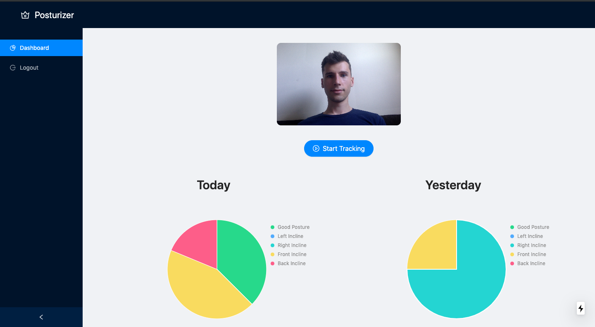
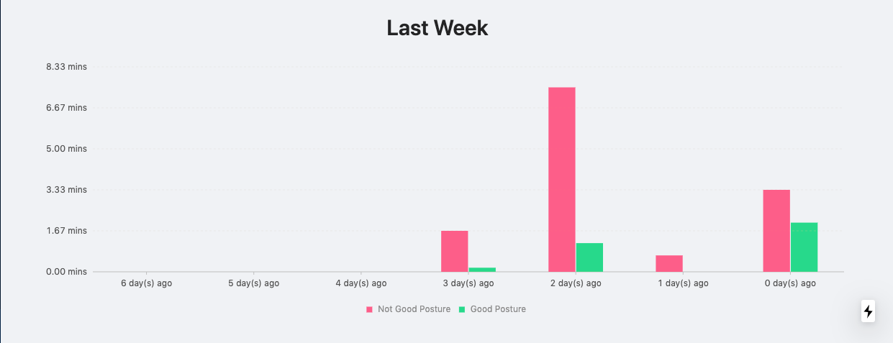

# Posturizer

## Hack The North 2019
This project was made as part of the great hackathon in 36h hours. 

**An easy solution for your posture problems!**
Posturizer will fix your posture by looking at your posture through the front webcam and will speak suggestions to you to help you improve the way you're sitting. With individual user accounts, we provide a personalization for each user and give you metrics on your rate of progress on improving your posture!

## Screenshots

## How to Run
 0. Train the model and get the firebase firestore credentials
 1. `git clone link_of_this_repository`
 2. `npm i` to install all dependencies
 3. `npm i -g nodemon` to install nodemon
 4.  `npm run dev` to run the program and navigate to http://localhost:3000

## How We Were Built
Posturizer is a web app built with next-js + react-js with a firebase database. Our backend is Microsoft Azure's custom vision model trained on images of different postures. 

